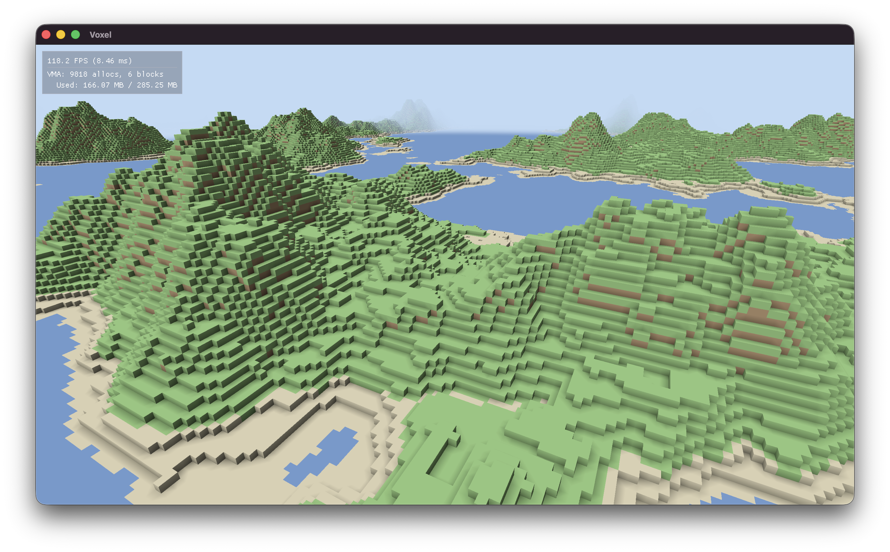

# Vulkan Voxel Project

A work-in-progress Vulkan-based voxel renderer built with C++23 — an experiment in building a Vulkan game engine from scratch, using SDL3 for windowing and Vulkan RAII wrappers for safe resource management.



## Prerequisites

- CMake 3.25+
- C++23 compatible compiler
- Vulkan SDK (with `glslc` shader compiler)
- Git (for vcpkg submodule)

## Getting Started

```bash
git clone --recurse-submodules <repo-url>
cd vulkan-voxel-project

# Bootstrap vcpkg
./vcpkg/bootstrap-vcpkg.sh

# Configure and build
cmake --preset default
cmake --build build

# Run tests
cd build && ctest --output-on-failure

# Run the application
./build/voxel/voxel
```

## Controls

- **Left-click drag** — Mouse look
- **WASD** — Move on XY plane
- **Space / Left Shift** — Move up / down (Z axis)
- **Tab / Left Ctrl** — Sprint (latches while moving, 2x speed)

## Project Structure

```
├── steel/          Vulkan RAII helpers (namespace: steel)
│   ├── engine      SDL3 window, Vulkan instance/device/swapchain, deferred GPU resource destruction, FXAA post-processing, ImGui integration
│   ├── swapchain   Swapchain, depth buffer, offscreen target, scene render pass
│   ├── pipeline    Fluent graphics pipeline builder (dynamic viewport/scissor)
│   ├── buffer      Vertex/index buffer creation with staging upload
│   ├── uniform_buffer  Header-only per-frame UBO template with descriptor management
│   ├── fxaa_pass   FXAA 3.11 post-processing pass
│   ├── imgui_pass  Dear ImGui rendering pass
│   └── shaders/    Internal GLSL shaders (FXAA 3.11), compiled to embedded SPIR-V at build time
├── glass/          Engine abstraction layer (namespace: glass)
│   ├── shader      SPIR-V loader (stage + binary data)
│   ├── mesh        Abstract data-only mesh interface (vertices/indices spans)
│   ├── geometry    GPU-side buffers created from a Mesh
│   ├── material    Shader pipeline wrapper (with descriptor set layout for per-frame UBO)
│   ├── entity      Lightweight entity handle (index + generation)
│   ├── component_pool  Sparse-set component storage
│   ├── world       Entity manager with component operations and pre-destroy callback
│   ├── view        Multi-component query iterator
│   ├── components  Transform, GeometryComponent, MaterialComponent, Velocity, CameraComponent
│   ├── camera      Projection-only perspective camera (view derived from Transform)
│   ├── renderer    ECS rendering with split view/projection UBO, explicit camera entity, automatic GPU resource cleanup
│   └── vertex      Shared vertex format (position + normal + color)
├── voxel/          Application executable (namespace: voxel)
│   ├── application Voxel terrain renderer with spectator camera and ImGui debug overlay
│   ├── voxel       VoxelType enum and helpers (Grass, Dirt, Stone, Sand, Snow, Water)
│   ├── chunk       16x16x16 voxel data storage
│   ├── chunk_mesh  Mesh generation with per-vertex AO, cross-chunk culling, and vertex welding
│   ├── chunk_manager  Multithreaded dynamic chunk loading/unloading with frustum prioritization
│   ├── terrain_generator  Multi-octave fBm terrain with TerrainColumn heightmap caching
│   ├── camera_controller  Spectator camera with velocity physics and sprint
│   ├── shaders/    GLSL shaders (compiled to SPIR-V via glslc)
│   └── main        Entry point
├── docs/           Design notes and scaling documentation
└── test/           Google Test suite
```

## Dependencies

Managed via [vcpkg](https://github.com/microsoft/vcpkg) (included as a git submodule):

| Package | Purpose |
|---------|---------|
| vulkan | Graphics API |
| vulkan-memory-allocator | GPU memory management |
| glm | Linear algebra (noise, transforms) |
| sdl3 | Windowing and input |
| gtest | Testing framework |
| spdlog | Structured logging |

## CMake Presets

| Preset | Build Type | Directory |
|--------|-----------|-----------|
| `default` | Debug | `build/` |
| `release` | Release | `build-release/` |

## Architecture

Three-layer architecture: **steel** -> **glass** -> **voxel**.

**steel** wraps Vulkan initialization and rendering into RAII types (`vk::raii::*`) so resources clean up automatically. The `Engine` class provides a `begin_frame()`/`end_frame()` interface with frames-in-flight synchronization, keyboard state, delta time, an optional event callback for application-level input handling, and always-on FXAA 3.11 anti-aliasing (quality preset 12 with edge endpoint search). `Engine::defer_destroy<T>()` holds any moveable GPU resource for `MAX_FRAMES_IN_FLIGHT + 1` frames before dropping it, preventing in-flight frame conflicts. `Swapchain` owns the swapchain, depth buffer, offscreen target, and scene render pass. `UniformBuffer<T>` is a header-only template managing per-frame-in-flight descriptor sets and persistently mapped buffers. `PipelineBuilder` uses a fluent API with dynamic viewport/scissor. `Buffer` handles device-local vertex and index buffer creation with staging transfers.

**glass** provides engine-level abstractions. `Camera` is projection-only (fov, aspect, near, far); the view matrix is derived from the entity's `Transform` via `glm::inverse()`. The ECS (`Entity`, `ComponentPool<T>`, `World`, `View<Ts...>`) uses sparse-set storage for O(1) component operations. `World` supports a pre-destroy callback, enabling automatic GPU resource cleanup when entities are destroyed. `Renderer` takes an explicit camera entity via `set_camera()`, and updates a per-frame UBO (set 0) with separate view and projection matrices. `Renderer::bind_world()` registers the destroy callback so that `GeometryComponent`-owned GPU buffers are automatically deferred-destroyed via Engine. Per-object model matrices are pushed via push constants. Standard components: `Transform`, `GeometryComponent` (owns `unique_ptr<Geometry>`), `MaterialComponent`, `Velocity`, `CameraComponent`.

**voxel** is the application. `ChunkManager` dynamically loads/unloads terrain around the camera within a configurable square radius. In-frustum chunks are prioritized over out-of-frustum ones, with distance as tiebreaker. Chunk generation (voxel fill + mesh build) runs on a pool of `std::jthread` workers with cooperative cancellation. `TerrainGenerator` produces terrain from 6-octave fBm simplex noise with a power curve for sharper peaks (16x16x16 voxels per chunk, Z-up). `TerrainColumn` precomputes the heightmap and gradient for a column, determining which Z slices need generation. Biomes include grass, dirt, stone, slope-aware sand near shorelines, snow above a noise-varying snow line, and opaque water below sea level. `ChunkMesh` performs per-face neighbor culling (with cross-chunk lookups), per-vertex ambient occlusion, AO-aware quad triangulation, and vertex welding. Shaders compute half-Lambert lighting and spherical exponential-squared distance fog in the vertex shader. The spectator camera uses velocity-based physics with subtractive friction, sprint support, and frame-rate independent integration. Application-level input (mouse capture, ImGui toggle) is handled via Engine's event callback.

On macOS, MoltenVK portability extensions are automatically enabled.
